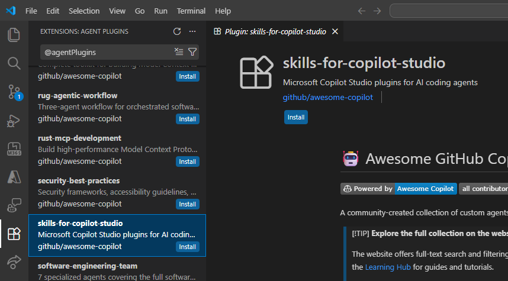

A toolkit for authoring, testing, and troubleshooting [Microsoft Copilot Studio](https://aka.ms/CopilotStudio) agents through YAML files. Available as a VS Code extension for GitHub Copilot Chat and as a plugin for [Claude Code](https://docs.anthropic.com/en/docs/claude-code).

[](https://github.com/microsoft/skills-for-copilot-studio/releases)

## Prerequisites

* [Node.js](https://nodejs.org/) 22+
* [VS Code](https://code.visualstudio.com/) with the [Copilot Studio Extension](https://github.com/microsoft/vscode-copilotstudio) (required for push/pull/clone operations)
* One of the following:
  * [GitHub Copilot](https://marketplace.visualstudio.com/items?itemName=GitHub.copilot) and [GitHub Copilot Chat](https://marketplace.visualstudio.com/items?itemName=GitHub.copilot-chat) extensions (for the VS Code extension)
  * [Claude Code](https://docs.anthropic.com/en/docs/claude-code) (for the CLI plugin)

## Installation

### VS Code extension (recommended)

Install the **Copilot Studio Development Bundle** to get everything you need in one click:

[Install Copilot Studio Development Bundle](https://marketplace.visualstudio.com/items?itemName=coatsy.copilot-studio-development-bundle)

Or from the command line:

```bash
code --install-extension coatsy.copilot-studio-development-bundle
```

The bundle installs both the **Copilot Studio Skills** extension and the **Copilot Studio** extension together. Once installed, the agents and skills are available in GitHub Copilot Chat. See [SETUP_GUIDE.md](SETUP_GUIDE.md) for a full walkthrough.

### Claude Code plugin from marketplace

```bash
/plugin marketplace add microsoft/skills-for-copilot-studio
/plugin install copilot-studio@skills-for-copilot-studio
```

### Claude Code plugin from a local clone

```bash
git clone https://github.com/microsoft/skills-for-copilot-studio.git

# Load for a single session
claude --plugin-dir /path/to/skills-for-copilot-studio

# Or install persistently (user-wide)
claude plugin install /path/to/skills-for-copilot-studio --scope user

# Or install for a specific project
claude plugin install /path/to/skills-for-copilot-studio --scope project
```

## Updating

The update process depends on how you installed the plugin:

| Interface | Update Method | Details |
|-----------|--------------|--------|
| **Claude Code CLI** | Auto-update (recommended) | Marketplace plugins update automatically. No action needed. |
| **GitHub Copilot CLI** | Manual | Run `/plugin update skills-for-copilot-studio` in an interactive session, or `copilot plugin update skills-for-copilot-studio` from the terminal. |
| **VS Code** | Extension auto-update | VS Code handles updates automatically when extension auto-update is enabled in settings. |

## Usage

The plugin provides four commands, each backed by a specialized agent:

```
/copilot-studio:copilot-studio-manage       Clone, push, pull, and sync agent content between local files and the cloud
/copilot-studio:copilot-studio-author       Create and edit YAML (topics, actions, knowledge, triggers, variables)
/copilot-studio:copilot-studio-test         Test published agents — point-tests, batch suites, or evaluation analysis
/copilot-studio:copilot-studio-troubleshoot Debug issues — wrong topic routing, validation errors, unexpected behavior
```

## Quick Start

```bash
# Clone an agent from the cloud (guided flow — opens browser for sign-in)
/copilot-studio:copilot-studio-manage clone

# Design and build topics
/copilot-studio:copilot-studio-author Create a topic that handles IT service requests

# Pull latest, push your changes
/copilot-studio:copilot-studio-manage pull
/copilot-studio:copilot-studio-manage push

# Publish in Copilot Studio UI, then test
/copilot-studio:copilot-studio-test Send "How do I request a new laptop?" to the published agent

# Troubleshoot and fix issues
/copilot-studio:copilot-studio-troubleshoot The agent is hallucinating — it's not using real data from our knowledge base
```

See [SETUP_GUIDE.md](SETUP_GUIDE.md) for a full end-to-end walkthrough including validation, testing options, and troubleshooting.


## Disclaimer

This plugin is an experimental research project, not an officially supported Microsoft product. The Copilot Studio YAML schema may change without notice. Always review and validate generated YAML before pushing to your environment — AI-generated output may contain errors or unsupported patterns.

## Contributing

See [CONTRIBUTING.md](CONTRIBUTING.md) for local development setup, building bundled scripts, and project structure.

## Appendix: Alternative installation methods

### From VS Code Extensions Store (GitHub Copilot)

You can also install directly from the VS Code Extensions view. Search for **Skills for Copilot Studio** using the **@agentPlugins** filter and click **Install**.



### GitHub Copilot CLI

If you use [GitHub Copilot CLI](https://docs.github.com/en/copilot), you can install from the marketplace:

```bash
/plugin marketplace add microsoft/skills-for-copilot-studio
/plugin install copilot-studio@skills-for-copilot-studio
```

To update:

```bash
# In an interactive session
/plugin update skills-for-copilot-studio

# Or from the terminal
copilot plugin update skills-for-copilot-studio
```