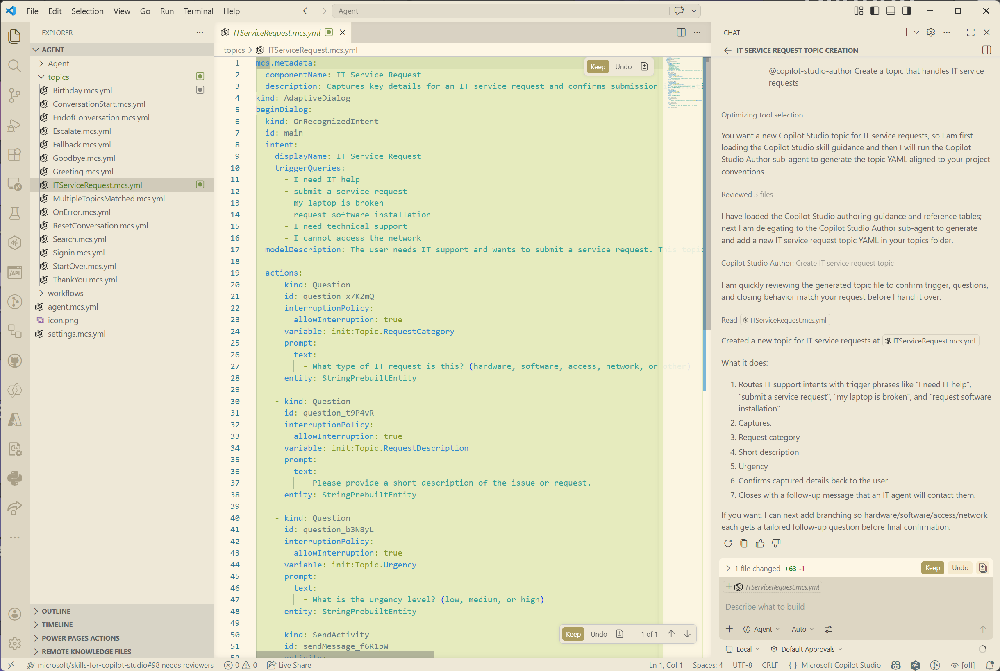
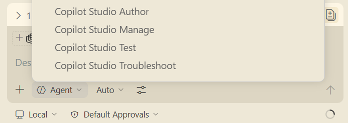
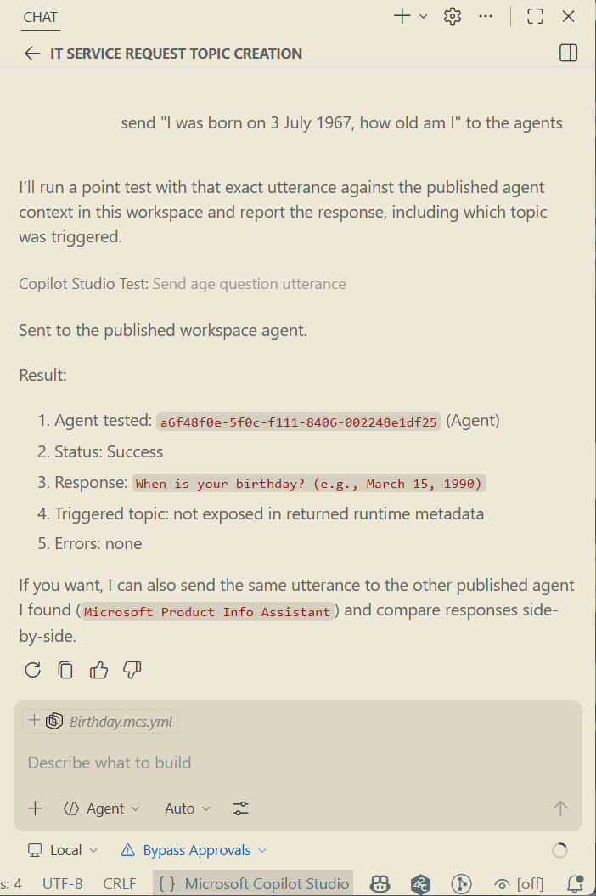
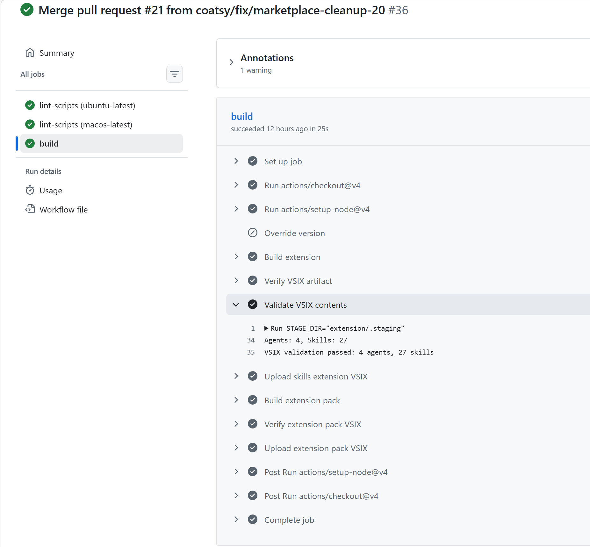

# Bringing Copilot Studio to VS Code: How We Built a Cross-Platform Agent Toolkit with GitHub Copilot Chat

<!-- PUBLICATION: Microsoft Tech Community blog post -->
<!-- AUTHOR: [Your Name], Microsoft -->
<!-- TAGS: Copilot Studio, VS Code, GitHub Copilot, Extensions, YAML, AI Agents -->

Developers who build Microsoft Copilot Studio agents spend most of their time in VS Code. But the Copilot Studio authoring experience lives in a web browser. I wanted to close that gap — and do it in a way that lets GitHub Copilot Chat be the interface for creating, testing, and managing agents, all from the editor.

The result is an open-source toolkit called [Skills for Copilot Studio](https://github.com/microsoft/skills-for-copilot-studio). It provides **4 specialized agents** and **24 skills** that bring the full Copilot Studio agent development lifecycle into VS Code through GitHub Copilot Chat. You can clone an agent from the cloud, author new topics in YAML, validate them against the real schema, push, publish, and test — without leaving your editor.

The toolkit started as a [Claude Code](https://docs.anthropic.com/en/docs/claude-code) plugin built by the Copilot Studio Customer Advisory Team (CAT). I then extracted it into a VS Code extension that packages the same agents and skills for GitHub Copilot Chat, using a build-time transformation pipeline and CI/CD automation. This post covers what the toolkit does, how the extraction works, and how we test and ship it.



## A quick word on Microsoft Copilot Studio

[Microsoft Copilot Studio](https://learn.microsoft.com/microsoft-copilot-studio/fundamentals-what-is-copilot-studio) is a low-code platform for building AI agents on the Power Platform. Agents are composed of **topics** (conversation flows with triggers and actions), **knowledge sources** (websites, SharePoint, Dataverse), **actions** (connectors to external services like Teams and Outlook), and **global variables** for state management.

Under the hood, every agent is defined in YAML files with the `.mcs.yml` extension. The official [Copilot Studio VS Code Extension](https://marketplace.visualstudio.com/items?itemName=ms-copilotstudio.vscode-copilotstudio) lets you clone agent content from the cloud into local YAML files and push changes back. It also provides the Language Server Protocol (LSP) binary that powers YAML validation — the same engine used by the Copilot Studio web UI.

What the official extension doesn't do is help you *write* the YAML. That's the gap this toolkit fills.

For a deeper introduction to Copilot Studio, see the [official documentation](https://learn.microsoft.com/microsoft-copilot-studio/).

```mermaid
graph LR
    subgraph cloud["☁️ Copilot Studio Cloud"]
        direction TB
        envs["Environments"]
        agents_cloud["Agents"]
        envs --- agents_cloud
    end

    subgraph workspace["📁 Local Workspace"]
        direction TB
        agent_yml["agent.mcs.yml"]
        topics["topics/"]
        actions["actions/"]
        knowledge["knowledge/"]
        lsp["Official Copilot Studio Extension\n(LSP binary)"]
    end

    subgraph chat["💬 GitHub Copilot Chat"]
        direction TB
        author["@copilot-studio-author"]
        manage["@copilot-studio-manage"]
        test["@copilot-studio-test"]
        troubleshoot["@copilot-studio-troubleshoot"]
    end

    cloud <-- "push / pull / clone" --> workspace
    workspace <-- "reads / writes YAML" --> chat

    style cloud fill:#e8f0fe,stroke:#4285f4,stroke-width:2px,color:#000
    style workspace fill:#fef7e0,stroke:#f9ab00,stroke-width:2px,color:#000
    style chat fill:#e6f4ea,stroke:#34a853,stroke-width:2px,color:#000
    style lsp fill:#fff3e0,stroke:#e65100,stroke-width:1px,color:#000
```



## The agents and skills

### How the toolkit evolved

The skills and agents didn't start life as a VS Code extension. They were born as a [Claude Code](https://docs.anthropic.com/en/docs/claude-code) plugin, built by the Copilot Studio Customer Advisory Team (CAT) at Microsoft. The CAT team works directly with customers building production agents and kept running into the same problem: every AI coding assistant they tried would hallucinate Copilot Studio YAML. The `kind:` values looked plausible, the structure was close, but the generated YAML would fail validation because the model was guessing at a schema it had never been trained on.

The solution was to encode the schema knowledge into skills — structured Markdown instructions that force the LLM to verify every construct against the real schema before writing it. The team bundled these into a Claude Code plugin with session hooks that route requests to specialized sub-agents (Author, Manage, Test, Troubleshoot), each with strict rules about which skills to invoke and when.

The Claude Code plugin is the most mature surface. It uses platform features like `allowed-tools` to restrict which tools a skill can access, `context: fork` for subprocess isolation, and session hooks that inject a routing prompt at conversation start. The hooks implement an orchestrator pattern: when a user asks to build a topic, the orchestrator delegates to the Author sub-agent, which delegates to the `new-topic` skill, which enforces schema validation. The user never interacts with skills directly — they talk to agents, which talk to skills.

From Claude Code, the toolkit expanded to [GitHub Copilot CLI](https://docs.github.com/en/copilot). The same plugin format works across both CLI surfaces, so the same agents, skills, and scripts run in GitHub Copilot's terminal-based interface with no changes to the source files.

The VS Code extension is the third surface — and the one that required real engineering work. Claude Code and GitHub Copilot CLI both understand the plugin format natively (frontmatter fields, session hooks, tool restrictions). VS Code's GitHub Copilot Chat uses a different mechanism: `contributes.chatAgents` and `contributes.chatSkills` registered in `package.json`, with `.agent.md` file extensions and no support for Claude Code-specific frontmatter. Bridging that gap is what the extraction methodology (covered later in this post) is all about.

The result is a single repository with one set of source files that produces artifacts for all three platforms. Claude Code and GitHub Copilot CLI consume the files directly. The VS Code extension is built from the same sources through a transformation pipeline that strips platform-specific metadata and repackages the content.

### Four agents for the full lifecycle

The toolkit provides four agents, each focused on a distinct phase of agent development:

| Agent | Purpose |
| ------- | --------- |
| `@copilot-studio-author` | Creates and edits topics, actions, knowledge sources, child agents, and global variables |
| `@copilot-studio-manage` | Clones, pushes, pulls, and syncs agent content between local YAML files and the Power Platform cloud |
| `@copilot-studio-test` | Tests published agents with point-tests, batch test suites, or evaluation analysis |
| `@copilot-studio-troubleshoot` | Debugs issues — wrong topic routing, validation errors, unexpected behaviour, hallucinations |

Each agent is a Markdown file with structured instructions that tell the LLM how to approach a specific class of tasks. The agents enforce strict skill usage — they never write YAML manually. Every operation goes through a skill that has the correct templates, schema validation, and patterns.

### Twenty-four skills across six categories

Skills are the building blocks. Each skill is a `SKILL.md` file in its own directory, containing detailed instructions, schema references, and templates for a specific operation:

| Category | Skills |
| ---------- | -------- |
| **Authoring** | `new-topic`, `add-action`, `add-node`, `add-knowledge`, `add-adaptive-card`, `add-generative-answers`, `add-global-variable`, `add-other-agents` |
| **Editing** | `edit-agent`, `edit-action`, `edit-triggers` |
| **Validation** | `validate`, `lookup-schema`, `list-kinds`, `list-topics` |
| **Testing** | `chat-with-agent`, `directline-chat`, `run-tests` |
| **Management** | `manage-agent`, `clone-agent` |
| **Best practices** | `best-practices` (JIT glossary loading, user context provisioning, dynamic topic redirects, orchestrator patterns) |

### Where the skills came from

The Copilot Studio CAT team originally built these as a Claude Code plugin. The skills encode deep domain knowledge about the Copilot Studio YAML schema — which `kind:` values are valid, how triggers work, what frontmatter the platform expects, and how to wire up Power Fx expressions. This knowledge was distilled from months of working with customers building production agents.

The key design principle: **skills prevent hallucination**. The number one source of errors in AI-generated Copilot Studio YAML is fabricated `kind:` values — action types that look plausible but don't exist in the schema. Every authoring skill mandates a schema lookup before writing any `kind:` value, using a bundled Node.js script (`schema-lookup.bundle.js`) that queries the actual Copilot Studio YAML schema:

```bash
# List all valid kind values
node scripts/schema-lookup.bundle.js kinds

# Verify a specific kind exists
node scripts/schema-lookup.bundle.js search SearchAndSummarizeContent

# Resolve the full definition of a kind
node scripts/schema-lookup.bundle.js resolve AdaptiveDialog
```

This means the LLM checks every YAML construct against the real schema before writing it, rather than relying on training data that may be outdated or incomplete.

## The VS Code extension and Development Bundle

### Copilot Studio Skills extension

The [Copilot Studio Skills](https://marketplace.visualstudio.com/items?itemName=coatsy.copilot-studio-skills) extension registers the 4 agents and 24 skills as GitHub Copilot Chat participants. After installing, the agents appear in the `@` mention list in Copilot Chat:

<!-- IMAGE: Screenshot of the @ mention dropdown
INSTRUCTIONS: Open Copilot Chat in VS Code. Type "@" in the input box. Capture the 
autocomplete dropdown showing the four Copilot Studio agents: copilot-studio-author, 
copilot-studio-manage, copilot-studio-test, copilot-studio-troubleshoot.
ALT TEXT: "Copilot Chat @ mention dropdown showing the four Copilot Studio agents" -->



The extension has no runtime code — it's entirely Markdown-driven. The agents and skills are registered through `contributes.chatAgents` and `contributes.chatSkills` in `package.json`, and GitHub Copilot Chat loads the Markdown content as context for the LLM.

### Copilot Studio Development Bundle

For the complete experience, the [Copilot Studio Development Bundle](https://marketplace.visualstudio.com/items?itemName=coatsy.copilot-studio-development-bundle) is an extension pack that installs both the Skills extension and the official Copilot Studio extension in one click:

```bash
code --install-extension coatsy.copilot-studio-development-bundle
```

The official extension provides the LSP binary needed for push, pull, clone, and validation operations. The Skills extension provides the AI-powered authoring, testing, and management layer on top.

## Usage examples

### Clone an agent

Start by cloning an agent from the cloud. Ask the Manage agent:

```text
@copilot-studio-manage Clone an agent from Copilot Studio
```

The agent walks you through environment selection, presents a list of agents, and downloads the YAML files. A browser window opens for sign-in — no app registration needed.

After cloning, your workspace contains:

```text
my-agent/
  agent.mcs.yml           # Agent settings and instructions
  settings.mcs.yml        # Environment settings
  topics/
    greeting.topic.mcs.yml
    fallback.topic.mcs.yml
    ...
  actions/
  knowledge/
  .mcs/
    conn.json              # Connection details (tenant, environment, agent)
```

### Author a new topic

Ask the Author agent to create a topic:

```text
@copilot-studio-author Create a topic called "Product Information" that asks the user 
which product category they want and responds with relevant details
```

The agent invokes the `new-topic` skill, verifies every `kind:` value against the schema, and generates a YAML file like this:

```yaml
# Name: Product Information
kind: AdaptiveDialog
beginDialog:
  kind: OnRecognizedIntent
  id: main
  intent:
    displayName: Product Information
    triggerQueries:
      - What products do you offer
      - Tell me about your products
      - Product information
      - Show me product categories

  actions:
    - kind: SendActivity
      id: sendMessage_a1b2c3
      activity:
        text:
          - I can help you find information about our products!

    - kind: Question
      id: question_d4e5f6
      variable: init:Topic.ProductCategory
      prompt: Which product category are you interested in?
      entity: StringPrebuiltEntity
      alwaysPrompt: true
      interruptionPolicy:
        allowInterruption: false

    - kind: ConditionGroup
      id: conditionGroup_g7h8i9
      conditions:
        - id: conditionItem_j1k2l3
          condition: =Topic.ProductCategory = "Hardware"
          actions:
            - kind: SendActivity
              id: sendMessage_m4n5o6
              activity: >
                Our hardware lineup includes laptops, desktops, and
                peripherals. Visit our catalog for full specifications.

        - id: conditionItem_p7q8r9
          condition: =Topic.ProductCategory = "Software"
          actions:
            - kind: SendActivity
              id: sendMessage_s1t2u3
              activity: >
                We offer productivity suites, developer tools, and
                cloud services. Check our licensing page for details.

      elseActions:
        - kind: SendActivity
          id: sendMessage_v4w5x6
          activity: >
            I don't have specific details for that category yet.
            Let me connect you with someone who can help.
```

Every `kind:` value in that file — `AdaptiveDialog`, `OnRecognizedIntent`, `SendActivity`, `Question`, `ConditionGroup` — was verified against the schema before being written.

### Validate

Ask the Troubleshoot agent to validate:

```text
@copilot-studio-troubleshoot Validate all topics in my agent
```

The `validate` skill invokes the LSP binary (from the official Copilot Studio extension) to run full diagnostics — YAML structure, Power Fx expressions, schema validation, and cross-file references. It's the same validation engine the Copilot Studio web UI uses.

### Push, publish, and test

```text
@copilot-studio-manage Push my changes to Copilot Studio
```

After pushing (which creates a draft), publish in the Copilot Studio UI, then test:

```text
@copilot-studio-test Send "What products do you offer?" to the published agent
```

The Test agent detects the authentication mode (DirectLine or integrated auth), establishes a connection, sends the utterance, and returns the agent's response — including the full conversation turn with any adaptive cards or follow-up prompts.

<!-- IMAGE: Copilot Chat test conversation
INSTRUCTIONS: Open Copilot Chat. Ask @copilot-studio-test to send a test utterance 
to a published agent. Capture the chat panel showing the test request and the agent's 
response, including any structured data in the reply.
ALT TEXT: "Testing a published Copilot Studio agent from Copilot Chat using the Test agent" -->



### Add a knowledge source with generative answers

A common pattern is adding a knowledge source and wiring it up to handle questions the agent doesn't have explicit topics for:

```text
@copilot-studio-author Add a knowledge source pointing to https://contoso.com/docs
```

The `add-knowledge` skill adds the knowledge source to the agent settings. Then, to enable generative answers as a fallback:

```text
@copilot-studio-author Add generative answers as a fallback for unknown questions
```

This creates a topic using the `SearchAndSummarizeContent` kind:

```yaml
# Name: Knowledge Search
kind: AdaptiveDialog
beginDialog:
  kind: OnUnknownIntent
  id: main
  priority: -1
  actions:
    - kind: CreateSearchQuery
      id: createSearchQuery_a1b2c3
      userInput: =System.Activity.Text
      result: Topic.SearchQuery

    - kind: SearchAndSummarizeContent
      id: searchContent_d4e5f6
      variable: Topic.Answer
      userInput: =Topic.SearchQuery.SearchQuery

    - kind: ConditionGroup
      id: conditionGroup_g7h8i9
      conditions:
        - id: conditionItem_j1k2l3
          condition: =!IsBlank(Topic.Answer)
          actions:
            - kind: EndDialog
              id: endDialog_m4n5o6
              clearTopicQueue: true
```

When the agent can't match a user's message to any topic, it generates an optimized search query, searches all knowledge sources, and summarizes the results — grounding the response in real data instead of hallucinating.

## The extraction methodology

### The design challenge

The original Claude Code plugin uses platform-specific constructs that don't exist in VS Code:

- **Frontmatter fields**: `allowed-tools` (restricting which tools a skill can use), `context: fork` (subprocess isolation), `agent` (routing to a parent agent), `argument-hint`, and `user-invocable`
- **Path variables**: `${CLAUDE_SKILL_DIR}` references in 19 of 24 skills, used to locate bundled Node.js scripts
- **File extensions**: Claude Code uses plain `.md` for agents; VS Code requires `.agent.md`

The challenge was: how do you support two platforms from a single set of source files without creating a maintenance burden?

### ADR-001: Evaluating the options

I documented this decision as an [Architecture Decision Record](https://github.com/microsoft/skills-for-copilot-studio/blob/coatsy/vscode-extension/extension/docs/adr/001-artifact-file-strategy.md) (ADR-001) in the repo. Five options were evaluated:

| Option | Approach | Risk | Why not |
| -------- | ---------- | ------ | --------- |
| A | Single shared files, no transformation | Medium | Untested whether VS Code ignores unknown frontmatter fields |
| B | Build-time copies with full transformation | Medium | Transform script becomes a maintenance burden across 39 files |
| C | Parallel hand-maintained files | High | 40+ files to keep synchronized, guaranteed drift |
| D | Shared files with platform override patches | Low-medium | More engineering for minimal benefit over Option E |
| **E** | **Shared files with frontmatter-only stripping** | **Low** | **Selected** |

**Option E** won because it provides the best balance of safety, simplicity, and maintainability. The key insight: VS Code Copilot Chat reads skill bodies as LLM context — it doesn't execute bash commands. The `${CLAUDE_SKILL_DIR}` references in skill bodies are informational, not runtime code. Stripping them would lose useful context about what scripts exist, while leaving them is harmless.

### What the build script does

The build pipeline is a single Bash script ([`extension/test-local.sh`](https://github.com/microsoft/skills-for-copilot-studio/blob/coatsy/vscode-extension/extension/test-local.sh)) that transforms the source files into a VS Code extension:

**Step 1: Stage agents**. Copies agent Markdown files from `agents/`, renaming `.md` → `.agent.md` (the suffix VS Code requires for `contributes.chatAgents`). The source files remain as `.md` for Claude Code compatibility.

**Step 2: Stage skills**. Copies skill directories and strips five Claude Code-specific frontmatter fields from each `SKILL.md`:

```yaml
# These fields are stripped at build time:
allowed-tools: Bash(node *schema-lookup.bundle.js *), Read, Write, Glob
context: fork
agent: copilot-studio-author
argument-hint: <topic description>
user-invocable: false
```

After stripping, only the portable fields remain (`name`, `description`), plus the full skill body with instructions and examples.

**Step 3: Resolve paths**. Replaces `${CLAUDE_SKILL_DIR}/../../` references with relative `../../` paths. In the VSIX layout, skills live at `skills/<name>/SKILL.md`, so `../../` resolves to the extension root — the same relative structure as the source repo.

**Step 4: Generate `package.json`**. Dynamically discovers all staged agents and skills and populates the `contributes` section:

```javascript
// Discovery logic (simplified)
const agents = fs.readdirSync('agents/')
  .filter(f => f.endsWith('.agent.md'))
  .map(f => ({
    path: './agents/' + f,
    name: parseFrontmatter(f).name,
    description: parseFrontmatter(f).description
  }));

const skills = fs.readdirSync('skills/')
  .filter(d => fs.existsSync(`skills/${d}/SKILL.md`))
  .map(d => ({
    path: `./skills/${d}/SKILL.md`,
    name: d,
    description: parseFrontmatter(`skills/${d}/SKILL.md`).description
  }));

pkg.contributes = { chatAgents: agents, chatSkills: skills };
```

No manual registration. Add a new agent file or skill directory, and the build picks it up automatically.

**Step 5: Package**. Runs `vsce package` to produce a `.vsix` file.

<!-- IMAGE: Pipeline flow diagram (create in a diagramming tool)
CONTENT: A horizontal pipeline with 5 stages:
  1. "Source Repo" → agents/*.md, skills/*/SKILL.md
  2. "Stage" → Copy + rename .md → .agent.md
  3. "Transform" → Strip frontmatter fields, resolve paths
  4. "Discover" → Scan agents + skills → populate package.json
  5. "Package" → vsce → .vsix → Marketplace
  Below the pipeline: "extension/test-local.sh" label spanning all stages
ALT TEXT: "Build pipeline diagram showing the 5 stages from source repo to
VS Code Marketplace" -->

### The extension pack

The Development Bundle is a separate `extension-pack/` directory with its own `package.json` and build script. It's a standard VS Code extension pack that declares dependencies on both extensions:

```json
{
  "name": "copilot-studio-development-bundle",
  "extensionPack": [
    "ms-copilotstudio.vscode-copilotstudio",
    "coatsy.copilot-studio-skills"
  ]
}
```

Both the Skills extension and the Development Bundle are versioned in lockstep and published together.

## CI/CD and testing

### Build workflow

The [build workflow](https://github.com/microsoft/skills-for-copilot-studio/blob/coatsy/vscode-extension/.github/workflows/build-extension.yml) (`build-extension.yml`) runs on every push and pull request that touches agent, skill, script, template, reference, or extension files. It consists of two jobs:

**Lint job** (runs on Ubuntu and macOS in parallel):

1. Validates shell script syntax with `bash -n`
2. Runs [ShellCheck](https://www.shellcheck.net/) at warning severity on all scripts

**Build job** (depends on lint passing):

1. Sets up Node.js 22
2. Runs `bash extension/test-local.sh --package-only` with `CODE_CMD=true` (skips the VS Code install step, which isn't available in CI)
3. Verifies a `.vsix` file was produced
4. **Validates VSIX contents**:
   - Confirms agents and skills were discovered (counts > 0)
   - Verifies no Claude Code-specific fields remain in staged skills (`allowed-tools`, `CLAUDE_SKILL_DIR`, `user-invocable`)
   - Checks that all required directories exist (`agents/`, `skills/`, `scripts/`, `templates/`, `reference/`)
5. Builds and verifies the extension pack
6. Uploads both VSIX files as build artifacts (retained for 30 days)

The validation step is the safety net for the frontmatter stripping. If the transform fails or misses a field, CI catches it.

### Publish workflow

The [publish workflow](https://github.com/microsoft/skills-for-copilot-studio/blob/coatsy/vscode-extension/.github/workflows/publish-extension.yml) (`publish-extension.yml`) triggers on GitHub Release creation or manual dispatch:

1. Resolves the version from the release tag (strips the `v` prefix)
2. Validates the version matches both manifests (`package.template.json` and `extension-pack/package.json`)
3. Builds both VSIX files
4. Publishes to the VS Code Marketplace using a `VSCE_PAT` secret
5. Supports a dry-run mode for testing without publishing

The version match check prevents accidentally publishing mismatched extensions — the Skills extension and the Development Bundle must always be on the same version.

### Agent testing

The toolkit includes three testing approaches for the agents themselves:

**Point-testing**: The Test agent sends a single utterance to a published agent and returns the response. It auto-detects the agent's authentication mode (DirectLine for agents with no auth or manual auth; Copilot Studio SDK for agents with integrated Entra ID auth) and establishes the appropriate connection.

**Batch test suites**: Integration with the [Power CAT Copilot Studio Kit](https://github.com/microsoft/Power-CAT-Copilot-Studio-Kit) for running pre-defined test sets with expected responses and pass/fail scoring.

**Evaluation analysis**: Export evaluation results from the Copilot Studio UI as CSV, then ask the Test agent to analyse failures and propose YAML fixes.

### LSP-based YAML validation

The `validate` skill uses the official Copilot Studio LSP binary (shipped with the Copilot Studio extension) to run full diagnostics on agent YAML files. This provides the same validation the web UI uses: YAML structure, Power Fx expression syntax, schema validation, and cross-file reference checking. Validation runs locally — no cloud round-trip required.

<!-- IMAGE: GitHub Actions build run
INSTRUCTIONS: Go to the GitHub Actions tab on the repository. Open a successful 
"Build Extension" workflow run. Expand the build job to show the validation steps 
("Validate VSIX contents" step expanded showing agent/skill counts and the 
"VSIX validation passed" output). Capture the full Actions UI.
ALT TEXT: "GitHub Actions workflow run showing successful extension build and 
VSIX validation" -->



## Summary

This project demonstrates a pattern for building cross-platform AI tooling from a single source of truth:

1. **Author once**: Agents and skills are Markdown files maintained in one location, used by both Claude Code and VS Code
2. **Transform at build time**: A lightweight script strips platform-specific metadata without modifying source files
3. **Discover automatically**: The build dynamically registers agents and skills, so adding new ones requires no manual wiring
4. **Validate in CI**: The pipeline checks that the transformation was complete and the extension contents are correct
5. **Ship atomically**: Both extensions are versioned together and published in a single workflow

The toolkit is open source and experimental. It's not an officially supported Microsoft product, and the Copilot Studio YAML schema may change without notice. But it's functional, tested, and actively used for building production agents.

**Try it**:

- [Install the Copilot Studio Development Bundle](https://marketplace.visualstudio.com/items?itemName=coatsy.copilot-studio-development-bundle)
- [Browse the source on GitHub](https://github.com/coatsy/skills-for-copilot-studio)
- [Read the setup guide](https://github.com/coatsy/skills-for-copilot-studio/blob/main/SETUP_GUIDE.md)
- [File an issue or contribute](https://github.com/coatsy/skills-for-copilot-studio/issues)
